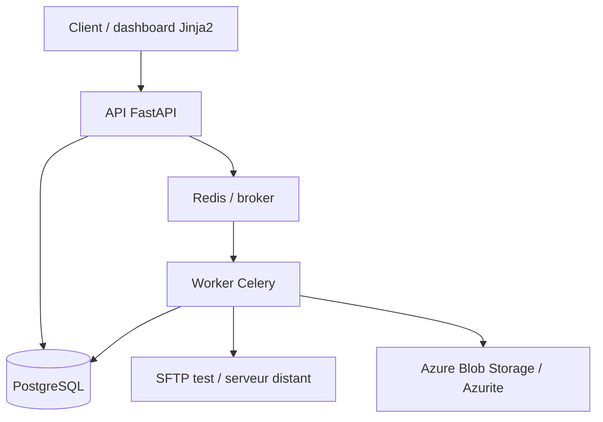

# BridgeOps


<!-- Badge CI à activer une fois GitHub Actions configuré :
 -->

BridgeOps est un petit projet personnel pour orchestrer des transferts de fichiers. L’idée est simple: prendre un fichier source, l’envoyer vers une destination, garder l’historique, et repartir proprement en cas d’échec.

## Ce que fait le projet

- crée un transfert à partir d’une source et d’une destination
- lance l’exécution en asynchrone via Redis + Celery
- enregistre un log par tentative
- retente automatiquement en cas d’échec
- gère deux types de destination: SFTP et Azure Blob Storage
- chiffre les credentials en base

## Architecture



| Brique | Techno |
|---|---|
| API | FastAPI |
| Authentification | JWT |
| Asynchrone | Redis + Celery |
| Base de données | PostgreSQL |
| Stockage fichiers | SFTP, Azure Blob Storage |
| Dév local | Azurite, conteneur SFTP de test |
| Frontend | Jinja2 + HTML |
| Conteneurisation | Docker Compose |
| Tests | Pytest |
| CI | GitHub Actions |

## Pourquoi ces choix

J’ai choisi FastAPI pour rester sur un backend léger, lisible et bien adapté à l’async.

Celery + Redis permet de gérer les tâches longues et les retries sans bricolage maison.

PostgreSQL colle bien au modèle du projet: transferts, historique et credentials sont des données relationnelles.

Pour les credentials, j’utilise `Fernet` parce que c’est simple à mettre en place pour un projet portfolio. En production, l’évolution logique serait plutôt un vrai gestionnaire de secrets.

Azurite et le serveur SFTP de test servent à bosser localement sans dépendre d’un service externe.

## Lancer le projet

```bash
cp .env.example .env
docker compose up --build
```

L’API est disponible sur `http://localhost:8000`, et Swagger sur `http://localhost:8000/docs`.

## Tests

```bash
pytest
```

## Démonstration

Une courte démo du flux complet reste à ajouter: création d’un transfert, retry, puis upload final.

## Licence

MIT